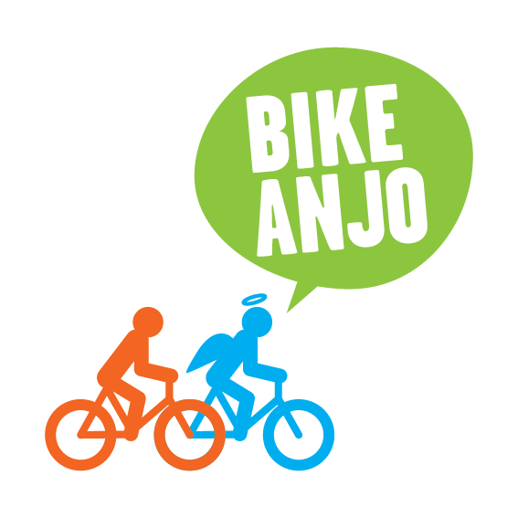

<p align="center">
  
</p>

# Bike Anjo

[](https://app.netlify.com/projects/bikeanjo/deploys)

# Technologies

- [Vite](https://vite.dev)
- [React](https://react.dev)
- [TypeScript](https://www.typescriptlang.org)

# Installation

Install project dependencies:

```bash
npm install
```

## Tests

Install Playwright browsers:

```bash
npx playwright install
```

Install Playwright operating system dependencies:

```bash
sudo npx playwright install-deps
```

# Usage

Run the project locally:

```bash
npm run dev
```

## Tests

Run unit tests:

```bash
npm run test
```

Run E2E tests:

```bash
npm run test:e2e
```

## Storybook

To start Storybook and view the UI components in development, run:

```bash
npm run storybook
```

## API & Deploy

API de email disponível no diretório `/api`.  
**Nota:** A API não funciona no Netlify - requer deploy separado em servidor.

Deploy via Docker disponível através do `deploy/start.sh`:
- `./deploy/start.sh -stage` - Testes locais
- `./deploy/start.sh -prod` - Deploy em produção (requer credenciais e acesso ao servidor)

Veja [`deploy/README.md`](deploy/README.md) para detalhes.

---

## Contato

- Website: [bikeanjo.org](https://bikeanjo.org)
- Email: contato@bikeanjo.org

## Licença

Este projeto está sob a licença [GPL-3.0](LICENSE.md).

---

## Equipe

### Design
- **Teko** - Design e identidade visual 

### Desenvolvimento
- **Lucas Guima** ([@lguima](https://github.com/lguima)) - Desenvolvimento inicial
- **Sarah Yukino Nakada** ([@sarassaura](https://github.com/sarassaura)) - Desenvolvimento principal
- **Silvia Abe** ([@silviaabe](https://github.com/silviaabe)) - Layout e componentes

### Colaborações
- [@mariagmss](https://github.com/mariagmss)
- [@jamile-xavier](https://github.com/jamile-xavier)

### Coordenação
- **Julia Guzman** - Gerente de projeto
- **Ian Thomaz** ([@ianthomaz](https://github.com/ianthomaz)) - Delivery

---

<p align="center">
  Feito com ❤️ pela Associação Bike Anjo e voluntariado
</p>
